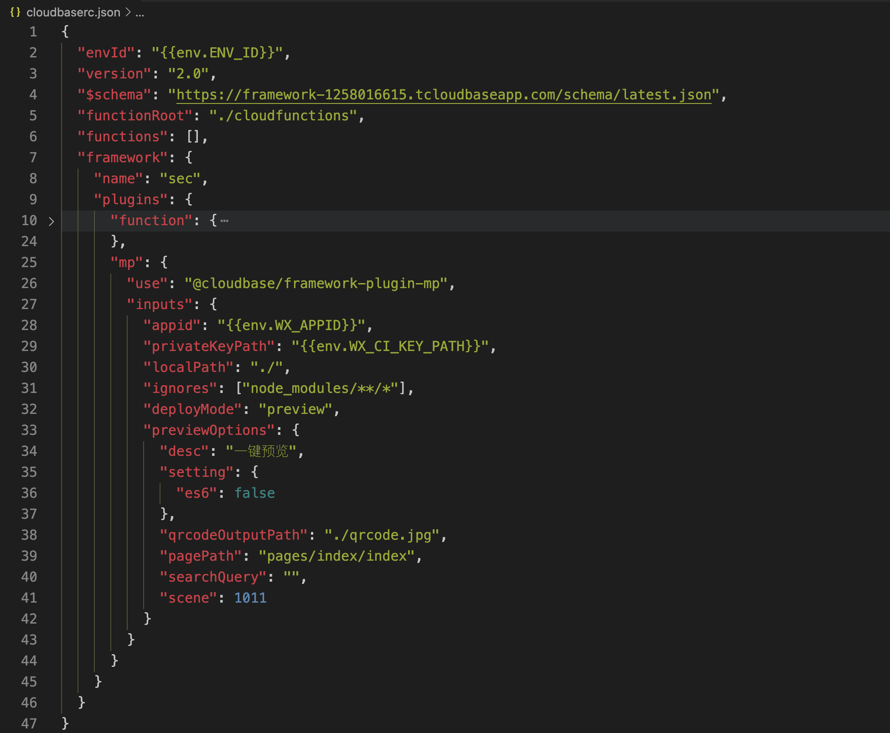
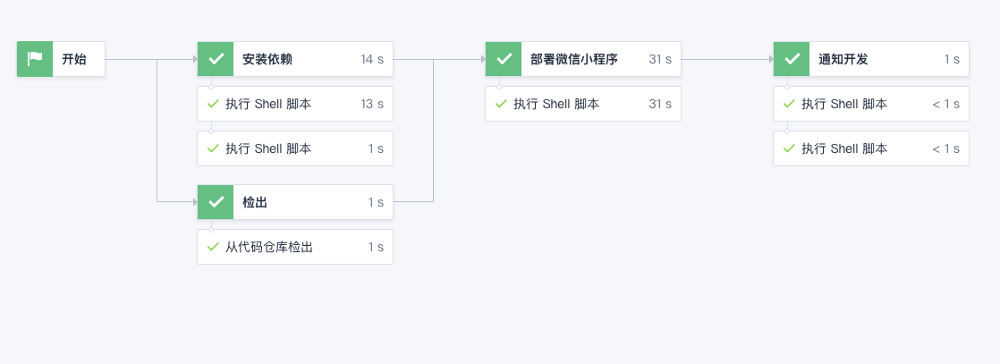
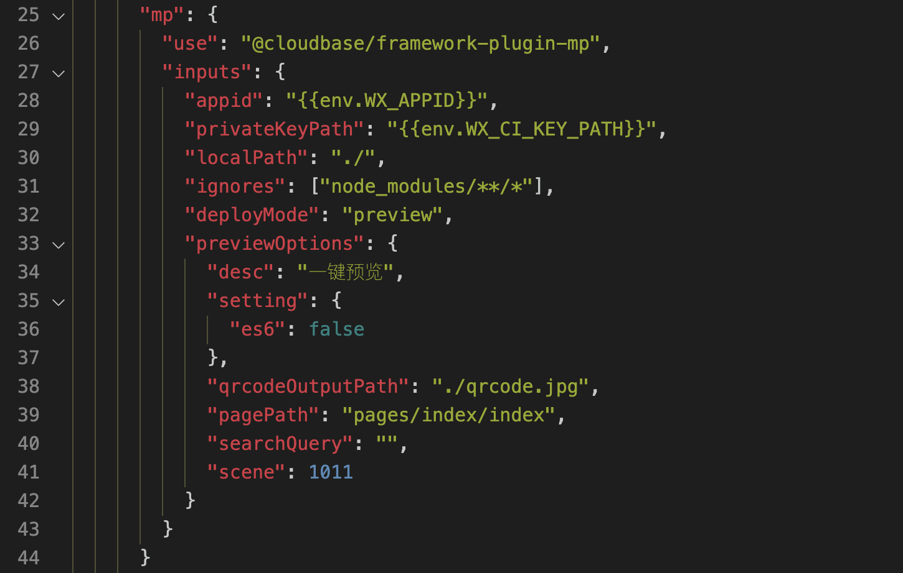
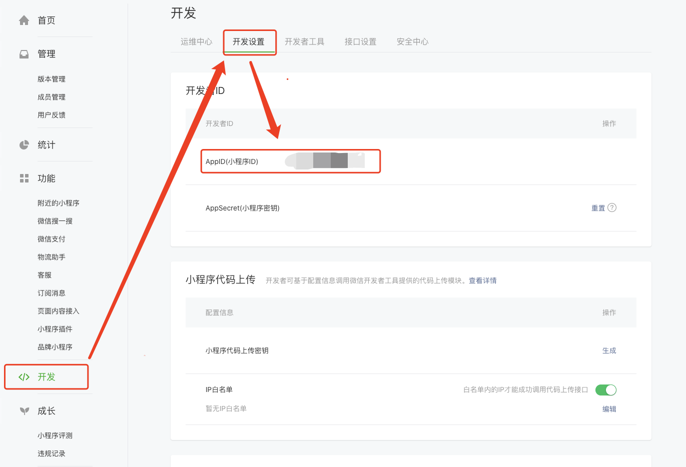
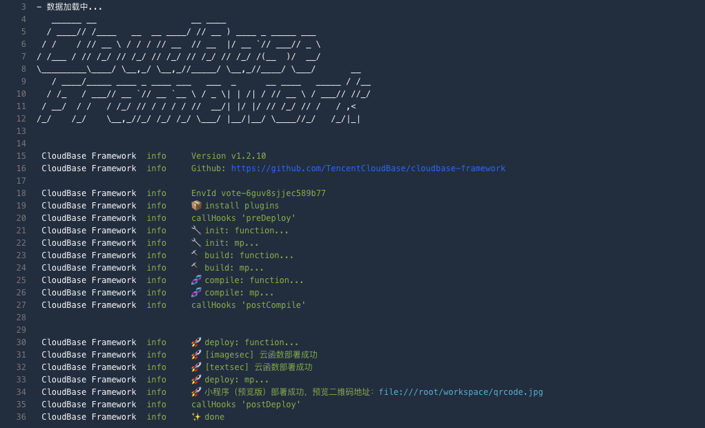

# 小程序·云开发地表最强 CI 利器来了

## 小程序 CI 与 CloudBase-FrameWork

从 2017 年开始，微信小程序的能力也随着前端的大发展的趋势越来越多，包体积限制越来越宽松，大型微信小程序的开发团队越来越多，为了适应形式，微信小程序官方团队在 2020 年 1 月推出了官方 CI 工具，可以进行代码上传、预览、拉取关键信息等操作，甚至还能简单的做云开发云函数的上传工作。

这对于大型小程序开发团队来说是好消息，其总算解决了微信小程序的工程化协作开发的历史难题。

云开发作为微信小程序的最佳后端云服务，单靠小程序 CI 工具，还是不能有效满足基于云开发进行小程序开发的协作问题，因为云开发所要涉及的，可是整个的后端服务，包括数据库等各项基础配置。

云开发以支持微信小程序为起点，朝全平台应用服务支持迈进的同时，也在 CI 方面做了相应的工作，推出了云开发专门的 CI 工具—CloudBase-FrameWork，是前后端一体化的部署工具，不止可以进行云开发相应能力的部署，还可以做前端项目的部署工作。

现在，CloudBase-FrameWork 支持部署微信小程序，除次之外，你还可以部署微信小程序所需要的全部云开发能力，包括云函数、数据库、存储等各种能力。同时，如果你的项目是一个跨平台的产物，还有 WEB 以及 APP 产品，CloudBase-FrameWork 也可以一次性完整的为你部署。

在项目开发协作中，除了业务代码之外，只需要在配置文件中进行相应配置，CloudBase-FrameWork 就可以自动完成相应部署工作。

所以，使用云开发作为后端服务的微信小程序开发团队，可以完全不用自己建设，直接使用即可。以下是小编在 Coding 中使用 CloudBase-FrameWork 的持续集成流程配置

配合企业微信的群机器人，在开发成员 push 代码后，自动构建并提醒开发者进行预览。

## 如何使用 CloudBase FrameWork 部署微信小程序

接下来小编就带大家简单实践一下，如何使用 CloudBase-FrameWork 部署微信小程序

步骤一：获取代码
点击进入[项目地址](https://github.com/TCloudBase/WXAPP-SecCheck)，获取实践的源码。这是一个比较简单的小程序，通过云开发·云调用提供的安全检测能力进行文字和图片的安全检测。

步骤二：配置 cloudbaserc 文件
项目的根目录中，有 cloudbaserc.json 文件，这是 CloudBase-FrameWork 工作的保障和依据。

其中，envId 是云开发环境 id，示例是通过环境变量引入形式给定的值，在实际部署时会被变量的值所替换。

插件是 cloudbase-framework 执行部署时发挥作用的模块，在示例项目中，只有部署云函数和部署小程序两件事情。

function 插件主要用于部署云函数，示例项目中有两个云函数，根据业务要求进行相应配置，framework 就会按照配置进行部署工作。

详细的部署文档可以参考[官方文档](https://github.com/Tencent/cloudbase-framework/tree/master/packages/framework-plugin-function)

mp 插件用于部署微信小程序，其将小程序有关代码打包上传，并返回相应的预览二维码。除了上传小程序所必要的配置信息，返回的二维码保存的地址也可配置。

详细的部署文档可以参考[官方文档](https://github.com/Tencent/cloudbase-framework/tree/master/packages/framework-plugin-mp)

以上所有配置文件如果无特殊想法无需修改。

步骤三：创建 env 文件
在示例项目的根目录创建.env 文件，设置自己的环境变量参数，包括云开发的环境 ID，小程序 appid，以及小程序代码上传私钥。具体效果如下：
ENV_ID=替换你的云开发环境 ID
WX_APPID=替换你的微信小程序 appid
WX_CI_KEY_PATH=小程序上传密钥文件路径

小程序 appid 是一个微信小程序的关键标识信息，可以在开发者后台的开发栏目里看到，如下图所示：

而小程序代码上传密钥，在 appid 的信息下方，点击生成按钮，经过微信验证下载密钥文件，将文件重新命名为 private.key，放置在示例项目根目录下。另外，代码上传的 IP 白名单需要关闭。

如果你想保持打开，可以在第一次 framework 部署时出现拒绝错误，将返回的 ip 地址（也就是你自己的本机 ip 地址）放置到白名单中。

云开发需要使用微信开发者工具提前开通，注意保存云开发环境 ID 信息。最终，配置的信息如下所示：

步骤四：安装依赖
framework 是集成在 CLI 工具中的，所以需要 npm 全局安装 CLI 工具，执行如下命令：
npm install -g @cloudbase/cli@latest

之后，直接执行 tcb 即可自动检测并部署，选择 Y，继续部署

之后，cloudbase-framework 就根据配置文件的要求进行部署，并将小程序的预览二维码保存到规定的地方。

不止简单的 CI 工具
如此，你便从本地完成 framework 自动化部署的过程。当然除了示例项目简单的云函数、微信小程序部署，cloudbase-framework 还可以同时完成更多的事情。比如部署数据库、云托管、Nuxt SSR 应用、Deno 应用、Node 应用等等，具体可以直接到[官网](https://github.com/Tencent/cloudbase-framework)获得

不仅如此，CloudBase-FrameWork 还推出了一键部署功能，特别适合开源项目使用。体验者只需要点击部署按钮，CloudBase-FrameWork 会直接跳转腾讯云控制台，引导体验者一步步的填写部署所需信息（包括选择环境，填写小程序 appid 等），直接拉取开源代码进行安装部署，彻底解决了因为体验者经验不同导致开源项目千人千面的窘迫境地。

如果你所在的开发团队还没有 get 这个最强利器，还等什么呢？

点击下面地址，尝试示例项目部署安全检查小程序
[https://github.com/TCloudBase/WXAPP-SecCheck](https://github.com/TCloudBase/WXAPP-SecCheck)

## CloudBase Framework 开源项目介绍

🚀 CloudBase Framework 是云开发开源的云原生前后端一体化部署工具，支持主流前后端框架，前后端一键托管部署在云端一体化平台，支持支持小程序、Web、Flutter、后端服务等多个平台。

Github 开源地址：[https://github.com/Tencent/cloudbase-framework](https://github.com/Tencent/cloudbase-framework)

欢迎给 CloudBase Framework 一个 🌟 star

## CloudBase Framework 核心贡献者计划

欢迎大家参与 CloudBase Framework 的开发工作，成为我们的贡献者，我们将会在云开发社区展示贡献者的作品和信息，同时也会有惊喜奖励。

您可以选择如下的贡献方式：

- 贡献技术文章：[https://github.com/Tencent/cloudbase-framework/tree/master/community/posts](https://github.com/Tencent/cloudbase-framework/tree/master/community/posts)
- 贡献应用：[https://github.com/Tencent/cloudbase-framework/blob/master/doc/app.md](https://github.com/Tencent/cloudbase-framework/blob/master/doc/app.md)
- 贡献代码，提交 Pull Request
- 反馈 bug，提交 Issue
- 在技术会议上发表技术演讲

CloudBase Framework 的发展离不开社区的积极贡献，这是我们的核心贡献者列表，再次感谢大家的贡献：[https://github.com/Tencent/cloudbase-framework#contributors-](https://github.com/Tencent/cloudbase-framework#contributors-)
